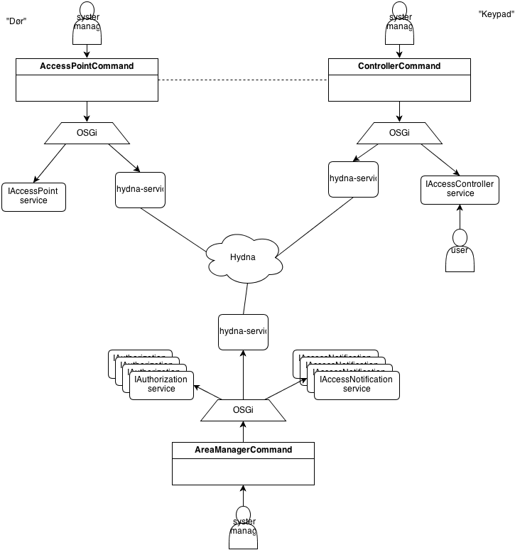

# Access Control system TTM3
This is an implementation for an access control system for the [TTM3](http://www.item.ntnu.no/academics/courses/ttm3) subject at the [NTNU](http://www.ntnu.no). This README file functions as the report. 

# Architecture
Using OSGi and Hydna technologies, this project provides a framework and some sample implementations for an access control system. Access control is a very generic term and is thus implemented as such; this implementation uses a central **AreaManager** which keeps track of all entities available inside the system. There are to kinds of entities; An can either be **AccessPoint** -- entity which can be in an allowing or denying state. It changes state upon receiving a message to do so from the AreaManager. An entity can be a **Controller**, which provides an interface to the outside world, which can be used to get access to an AccessPoint. The Controller doesn't communicate directly with the AccessPoint, but both communicate with the AreaManager. The AreaManager has services which can validate messages received from a Controller, and will send a message to the corresponding AccessPoint when it accepts the message from the Controller.

## Registration
The system is auto-configuring; the AreaManager is subscribed to an Hydna channel and listens for incoming subscribing AccessPoints and Controllers. We use Hydna for all message passing between JVMs (e.g. over the network). The AreaManager will keep track of all subscribed entities and keep a relation between them. Subscribing entities can provide a keyword which will associate them with each other. Entities get notified when another entity with the same keyword joins or leaves the system. Entities can use this to display their status to the world; for example a keypad can show that it is out of order when there are no AccessPoints with the same keyword.

## Access Control
The AreaManager contains a few different authorisation handlers (IAuthorization), which can check a message received from a compatible controller and return whether access should be granted. A request for access is always initiated from the Controller, which (after interfacing with the world) will send a message to the AreaManager. 

# Existing technologies
## SAML
This architecture has some very close parallels with the SAML protocol. SAML is for example used by Feide for logging in to innsida and studentweb, which are web services at the NTNU. SAML is a federated protocol, which means that there is not necessary a central hub like in the access control system described in this repo. Quickly explained, in SAML there are two kinds of parties; the SP (Service Provider) and the IdP (Identity Provider). The SP offers a service; at the NTNU innsida and studentweb are SPs. The IdP is the party where you proof your identity, so that the IdP can tell the SPs that you really are who you say you are. Because of this, SAML is a widespread solution for SSO (Single Sign On), since you only have to identify yourself only once per session at the IdP, and can use many SPs after.

The AccessPoint in our system works like a SP; it provides a server to the world, for example a door opens to let someone in. The AreaManager functions as the IdP, letting the SP know whether it should provide its service or not. The Controller doesn't have a parallel with SAML per sé -- but in SAML you will usually need some kind of authentication backend in the IdP which it will use to authenticate users, for example LDAP. The Controller fulfils this role.

A big difference is that in SAML, there is no explicit connection between Controllers and AccessPoints. The IdP simply establishes an identity; an attribute list using any arbitrary backend, which the SP should use to decide whether it will provide its service. However, [methods exist](https://github.com/yorn/sspmod_role) to move this functionality to the IdP, like in our system. A connection between a Controller and AccessPoint can be realised in SAML anyway when the SP knows about the different authentication backends the IdP uses, and looks only for attributes from that specific authentication backend when deciding whether to provide its services.

Another difference between this system and SAML is that SAML is a web technology; It is usually employed in situations where the SP is a web application. If one would want to use SAML in another domain, there must be some way for the IdP to recognise a user coming from different applications, which is a challenge. This kind of SSO is often resolved with a technology like Kerberos.

# Reflection
In this architecture, Hydna is used for dynamically adding and removing components from the system. This is quite logical, since you usually won't run an AccessPoint, AreaManager and Controller on the same JVM. However, it would make sense to make better use of OSGi in the AreaManager. The AreaManager has no way of loading or unloading anything, so **DBPassCodeAuthorization** and **TimedAuthorization** must be loaded when the AreaManager starts, or there will be no authorisation handler available. It would make sense to dynamically load authorisation handlers into the AreaManager as they are required by a subscribing Controller, unloading them as all requiring Controllers unsubscribe and to deactive all Controllers when the dependency is pulled. Right now the use of OSGi is underexposed in this application; it is used more for dependency solving which also could have been done with Maven.
